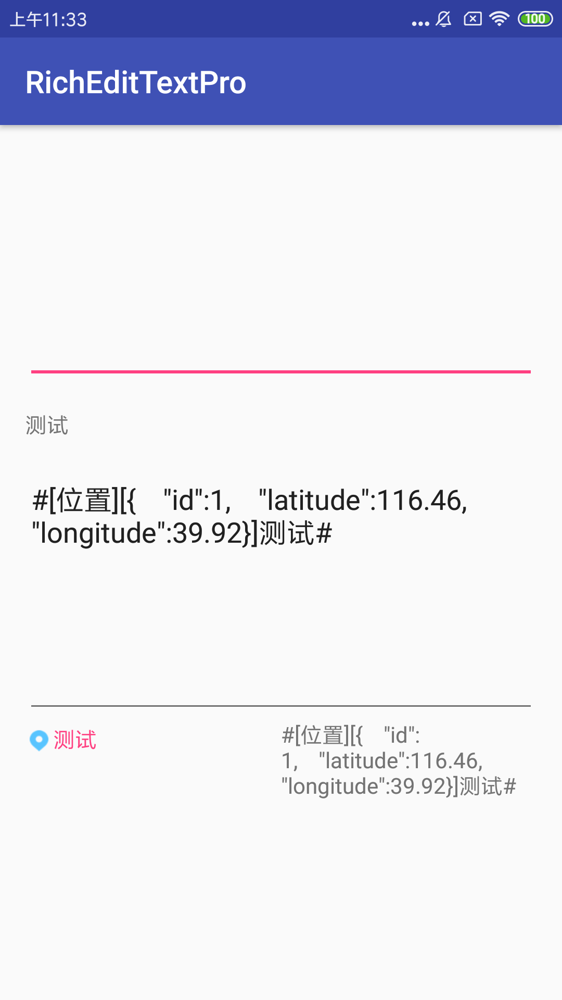
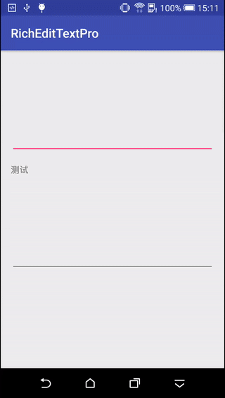
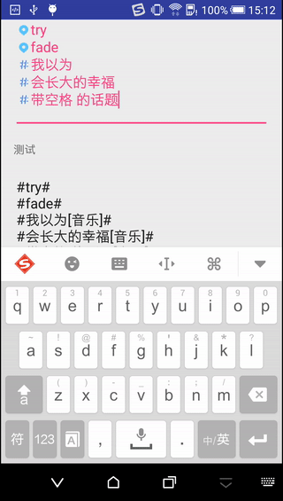
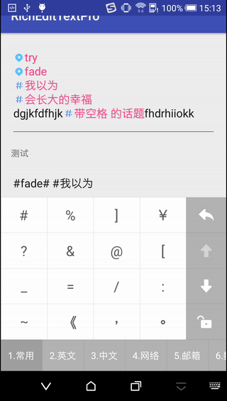

# 更新日志

- 2019.6.21

   - 精简大量代码
   - 富文本支持添加 `extra` 信息，如下图
   


# 前言

之前发过一个富文本编辑的项目，但是不完美，因为客户端的局限性比较大，现在做了一个完美版的富文本编辑，应该能够满足大部分需求了。

1、先看最基本的，富文本的<b>解析与反解析</b>。



2、富文本边界判断，不管是手指点击富文本，还是用软键盘移动两边的光标尝试选中富文本中间部分，都做了处理。



3、安全措施处理，比如用户输入跟我们正则表达式一样格式的内容，但是并不在我们允许的高亮富文本之内，则不让其高亮。

比如用户随便输入的`#测试#`，但很显然这样的一个话题在我们服务器中并不存在，所以就不允许高亮。




# 项目使用

1、布局文件中使用`com.xiaohongshu.richedittextpro.copy.RichEditTextPro`，跟使用`EditText`一样，没什么特别的。

2、构造`AbstractRichParser`子类对象，在构造方法中传入富文本的点击事件监听器，同时调用`AbstractRichParser.setRichItems `设置允许高亮的富文本列表。

3、使用`RichParserManager.getManager().registerParser`注册你的解析器，需要自己定义。

```
        RichParserManager.getManager().registerParser(
                new SimpleRichParser(this)
                        .setRichItems(createSimpleRichItemList()));
        RichParserManager.getManager().registerParser(
                new NormalRichParser(this)
                        .setRichItems(createNormalRichItemList()));
```

另外，如果需要自己处理富文本和文本，`RichParserManager`也提供了如下两个方法：

 - `parseStr2Spannable`：将字符串解析成富文本
 - `parseSpannable2Str`：将富文本反解析成字符串

具体看demo吧。

# 实现过程

关于富文本编辑框的实现思路，总结一下大概有三种实现方法：

## 初级版

### 思路

最简单的，也是之前发的那个项目使用的方法，使用不同的正则表达式去匹配，比如：

- `#话题#` -> `#话题 `
- `&位置&` -> `&位置 `
- `@某人@` -> `@某人 `

即分别用两个占位符将内容包起来，然后如果要显示成单hashtag的话，把后面的那个占位符替换成透明图片就好。

### 优缺点

这种方法的缺点是什么呢？不够灵活，因为每一种类型都需要一个占位符，而且还要考虑java本身一些字符有特殊含义，包括正则表达式里面很多字符也是有特殊含义，加上不能用高频率的那些英文字符，所以能用来作为占位符的符号其实很少。

而且每增加一种占位符，对用户输入内容进行误判的可能性更高。

除此之外，我们开始其实是照着新浪微博编辑框的需求来实现的，在微博的安卓版本中，字符串和富文本的转换关系是这样（有一个obj特殊字符，打不出来，暂时用O代替）：

- 发微博的时候是这样的：`O音乐` -> `▶️音乐`
- 发评论的时候是这样的：`#音乐[音乐]#` -> `#音乐🎵#`

但是在iOS版本中，只有一种转换关系：`#音乐[音乐]#` -> `▶️音乐`。这已经不只是简单的将占位符替换成图片这么简单了。

因此，这种方法其实并不是非常科学的。不过如果需求很急而且要求并不是非常高，那么这种方法其实也没有那么不堪。

## 进阶版

### 思路

这种方法是稍微改良的版本，解决了第1种方案中`#音乐[音乐]#` 不能转换成 `▶️音乐`的问题。

其实主要也是富文本的解析和反解析的问题，我们可以把服务器给的内容和本地需要显示的内容分别用两种不同的正则表达式来匹配。

比如对于`#音乐[音乐]#` -> `▶️音乐`这个需求，我们可以分别如下定义服务器和本地的富文本格式：

|      服务器         |        本地      |       展示     |
| ------------------ |:---------------:| --------------:|
|   `#音乐[音乐]#`    |     `#音乐#`     |     `▶️音乐 `   |
|   `#位置[位置]#`    |     `&音乐&`     |     `❗️位置 `   |

主要有两个过程，一个是把服务器给的内容A转换成本地可解析的B，然后将B按照第1种方案中的解决方式显示成想要的富文本。

其实相当于在第1种方案的基础上增加了一层将服务器内容解析到本地的过程，然后反解析的时候将富文本事先转换成本地字符串，然后转换成服务器可解析的格式，再传到服务器。

### 优缺点

所以除了`#音乐[音乐]#` -> `▶️音乐`这个需求已经可以实现之外，第1种方案中有的缺点第2种也有。

## 完美版

### 思路

将服务器返回的`#音乐[音乐]#`直接解析成`▶️音乐`，一步到位。

那么怎么反解析呢？其实第1、2种方案使用不同的占位符来区别不同的富文本类型，主要是用占位符来保存的富文本信息。

而我们使用富文本将占位符替换成图片时，其实都是使用了`ImageSpan`，那我们可以将富文本的所有信息（包括类型和内容）都放在`ImageSpan`中，需要反解析的时候，直接从`ImageSpan`中取出来即可。

而且除了可以保存类型和内容信息，还可以保存`id`、`别名`等任何其他信息，这一点十分的强大。

### 优缺点

由于前面两种方案都是用双hashtag的方式来匹配富文本，显示成单hashtag的时候是将后面的hashtag换成了透明图片，但是这种方式直接是根据Spannable的位置信息来解析和还原的，所以不存在那种问题。

除此之外，对于用户手动输入了富文本但是服务器中并不存在的这种情况也做了判断，如果输入的富文本在服务器中不存在，则不允许高亮。

还有很多。。

这种方案解决了第1、2种方案中所有的缺点，纯纯正正的富文本解析，但是实现也是比较麻烦的，具体可以看代码。

关于
--

博客：[http://blog.csdn.net/aishang5wpj](http://blog.csdn.net/aishang5wpj)

邮箱：337487365@qq.com

License
--
Copyright 2017 aishang5wpj

Licensed under the Apache License, Version 2.0 (the "License"); you may not use this file except in compliance with the License. You may obtain a copy of the License at

http://www.apache.org/licenses/LICENSE-2.0

Unless required by applicable law or agreed to in writing, software distributed under the License is distributed on an "AS IS" BASIS, WITHOUT WARRANTIES OR CONDITIONS OF ANY KIND, either express or implied. See the License for the specific language governing permissions and limitations under the License.